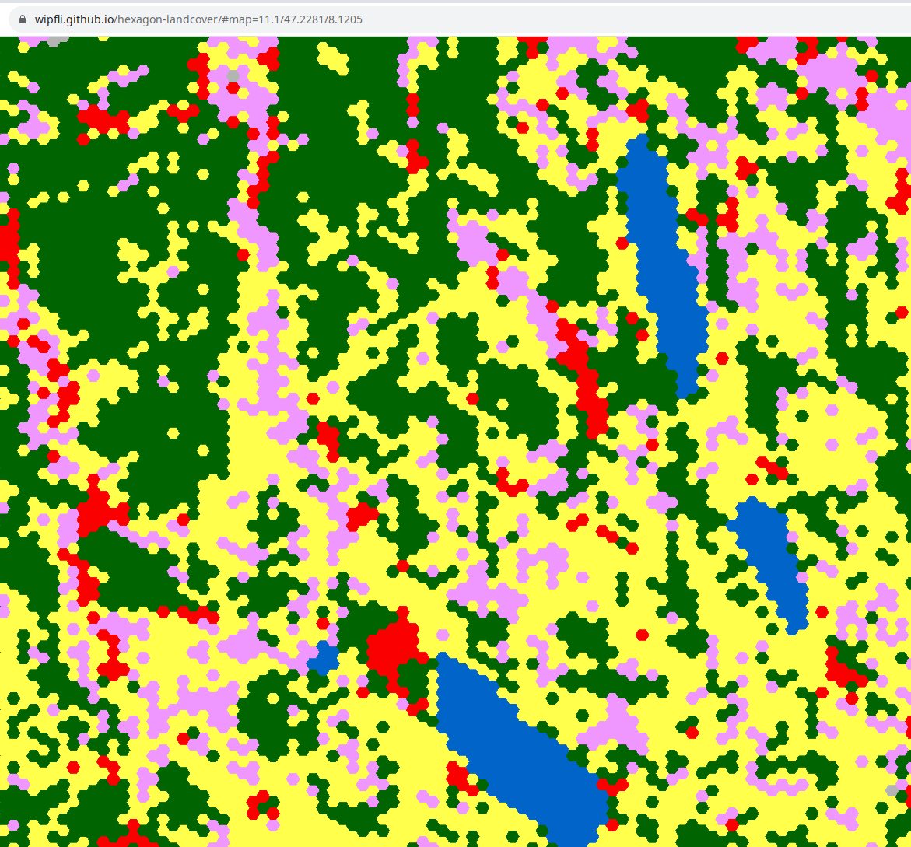
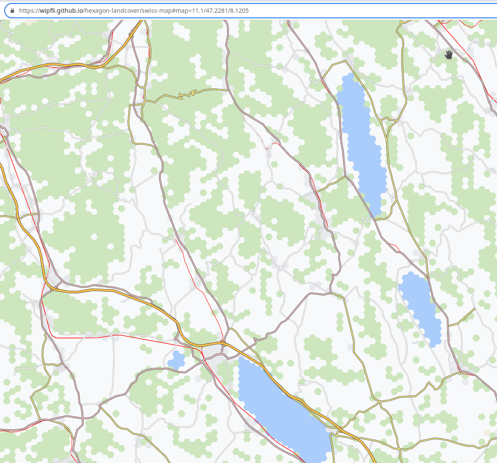
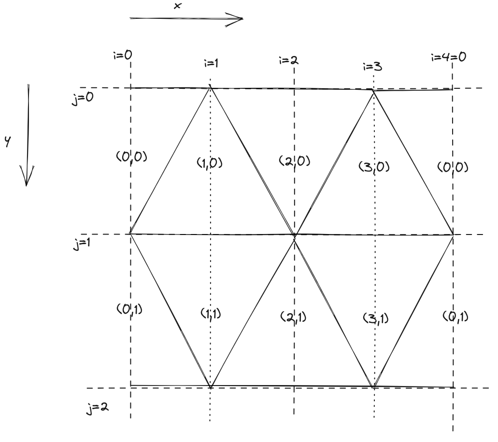
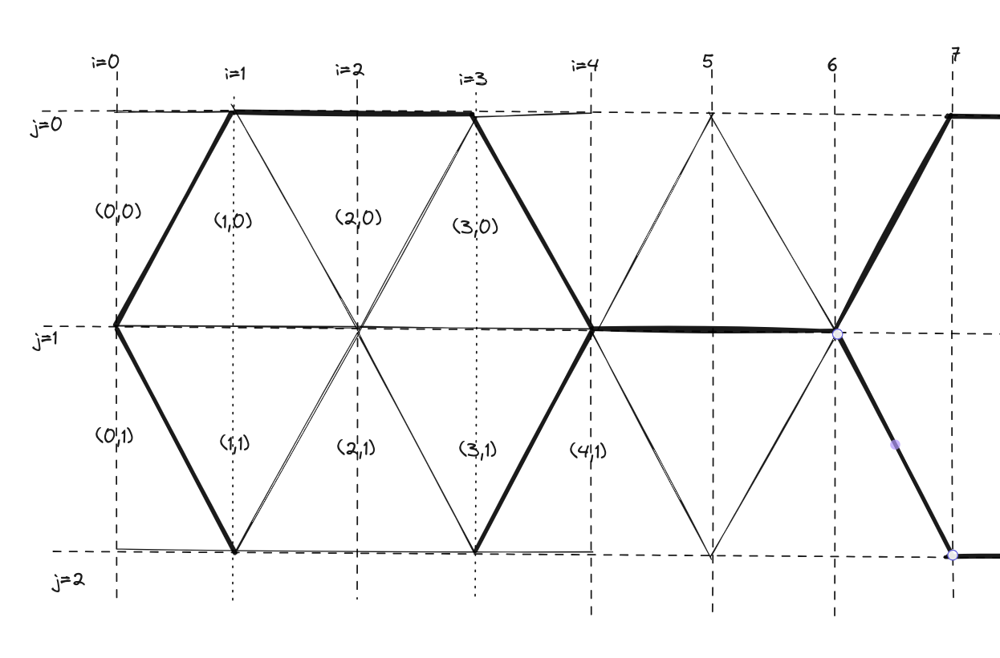

# hexagon-landcover
Use hexagons in the Web Mercator Projection to make a landcover vector tiles dataset

## Demos

### ESA Colors

Landcover only with the original ESA coloring

https://wipfli.github.io/hexagon-landcover/#map=11.1/47.2281/8.1205

<a href="https://wipfli.github.io/hexagon-landcover/#map=11.1/47.2281/8.1205">

</a>

### Swiss Map Colors

Landcover and some roads with the Swiss Map coloring

https://wipfli.github.io/hexagon-landcover/swiss-map#map=11.1/47.2281/8.1205

<a href="https://wipfli.github.io/hexagon-landcover/swiss-map#map=11.1/47.2281/8.1205">

</a>

## Overview





## Steps

```
./downloads/download.sh
./downloads/unzip-all.sh
```